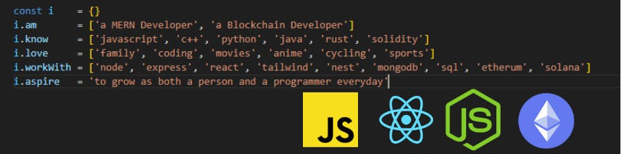

# Hi, I'm Suchit Kushwaha! 👋  

I am a **MERN and Blockchain Developer**

---

## 🚀 About Me  

  
---

## ✨ Fun Facts  
- I put **passion** behind everything I do—it's my greatest asset!  
- A self-proclaimed **web development and blockchain nerd**, I love turning ideas into reality.  

---

## 🛠️ Tech Stack  
**Languages & Frameworks**  
- **JavaScript** (Node.js, React.js, Nest.js, Express.js)  
- **Solidity** (EVM-based Smart Contracts)  
- **Rust** (Solana Development)  

**Tools & Platforms**  
- **AWS Services** (Cognito, SES, Secrets Manager)  
- **Docker & Kubernetes**  

**Databases**  
- **MongoDB, PostgreSQL, MySQL**
- **Redis with Queue Systems**  
  
---

## 📫 Let's Connect!  
- **Email**: [your-email@example.com]  
- **LinkedIn**: [your-linkedin-profile](https://linkedin.com/in/your-profile)  
- **Portfolio**: [your-portfolio.com](https://your-portfolio.com)  

Feel free to explore my repositories and reach out for collaboration! 🚀  

---

<!--
**voxer03/voxer03** is a ✨ _special_ ✨ repository because its `README.md` (this file) appears on your GitHub profile.

Here are some ideas to get you started:

- 🔭 I’m currently working on ...
- 🌱 I’m currently learning ...
- 👯 I’m looking to collaborate on ...
- 🤔 I’m looking for help with ...
- 💬 Ask me about ...
- 📫 How to reach me: ...
- 😄 Pronouns: ...
- ⚡ Fun fact: ...

-->
